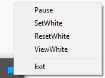

**Add option "Open project in the same window" in JetBrain ToolBox**   

# Install
  1. Open AutoCloseIDEA.exe
  2. Use JetBrain TOOLBOX
  
# Context Menu
 \
Whitelist is a string of window names with a separator "||" \
**Example:** *"project1 || some-project"* \
Both windows cannot be closed automatically +1 window that is closed automatically \
There will always be open from 1 to 3 windows. Depends on whether the "project1" or "some-project" are  opened  or not

# Developers
1. Install "AutoIt Full Installation" https://www.autoitscript.com/site/autoit/downloads/  
2. Right click to AutoCloseIDEA.au3 in contextmenu click to "Edit Script"

# Warring 
Don't open two "AutoClose IDEA.exe", it will conflict
 Don't open "AutoClose IDEA.exe" and run "AutoCloseIDEA.au3", it will conflict
